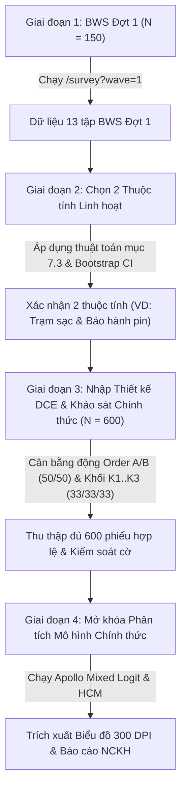

# HỆ THỐNG KHẢO SÁT BWS–DCE & BẢNG PHÂN TÍCH KẾT QUẢ NCKH
**Đề tài:** *Các rào cản ảnh hưởng đến sự sẵn sàng chuyển đổi từ xe máy xăng sang xe máy điện của người trẻ tại TP.HCM: Góc nhìn từ sự hoài nghi môi trường và đánh đổi lợi ích.*  
**Đối tượng khảo sát:** Người trẻ 18–30 tuổi, tự chủ tài chính, đang sử dụng xe máy xăng tại TP.HCM.  
**Mục tiêu cỡ mẫu:** 600 phiếu hợp lệ (cộng ~150 phiếu thử BWS Đợt 1).

---

## 1. Cấu trúc Tổng thể Hệ thống
Hệ thống gồm 3 phân hệ tích hợp chặt chẽ:
1. **Trang Khảo sát (`/survey`)**: Tối ưu mobile-first (Android 360px), hỗ trợ chế độ khảo sát trực tiếp Tablet (`?ch=offline`), chế độ BWS Đợt 1 (`?wave=1`).
2. **Trang Quản trị (`/admin`)**: Theo dõi tiến độ thu thập thời gian thực, giám sát cân bằng động A/B và K1–K3, theo dõi định mức mẫu (quotas), kiểm soát chất lượng qua cờ tự động, cấu hình ranh giới LEZ phường/xã, nhập/kiểm tra thiết kế DCE, xuất dữ liệu đa định dạng (CSV rộng, CSV Apollo dài, CSV BWS dài, Excel đa sheet).
3. **Bảng Phân tích (`/analysis`)**: Trực quan hóa kết quả các mô hình kinh tế lượng vi mô và hành vi theo đúng đặc tả Mục 7 (Apollo Choice Modelling & lavaan). Hỗ trợ khóa kết quả sơ bộ, xuất biểu đồ độ phân giải cao (≥ 300 DPI), xuất bảng và lưu trữ nhận xét khoa học của nhóm nghiên cứu.

---

## 2. Kiến trúc Kỹ thuật & Thư mục Dự án

```
ev_survey_system/
├── analysis/                     # Các kịch bản R độc lập & Plumber API
│   ├── 00_common.R               # Cấu hình chung, nạp gói và hàm tiện ích
│   ├── 01_data_quality.R         # 7.1 Thống kê mô tả, Cronbach's Alpha, Fatigue Check
│   ├── 02_bws_models.R           # 7.2 Điểm đếm BWS, MaxDiff Logit Apollo, Latent Class
│   ├── 03_bws_wave1_selection.R  # 7.3 Thuật toán chọn 2 thuộc tính từ BWS Đợt 1
│   ├── 04_dce_wtp_models.R       # 7.4 Mixed Logit không gian WTP, Hiệu chỉnh SD, Scale test
│   ├── 05_hcm_models.R           # 7.5 CFA lavaan & Hybrid Choice Model Apollo (S*, F*)
│   ├── 06_policy_simulation.R    # 7.6 Mô phỏng kịch bản S0-S5 qua 4 nhóm không gian LEZ
│   ├── plumber_api.R             # Plumber REST API cung cấp endpoint cho Web UI
│   ├── run_server.R              # Khởi chạy máy chủ API R
│   ├── simulate_data.py          # Sinh dữ liệu giả lập 600 người trả lời
│   └── parameter_recovery.R      # Kịch bản kiểm thử khôi phục tham số trong R
├── data/                         # CSDL và file thiết kế thực nghiệm
│   ├── hcmc_wards.json           # Danh sách phường/xã TP.HCM và cờ in_lez
│   ├── dce_design_blocks.csv     # 24 thẻ lựa chọn DCE (3 khối x 8 thẻ)
│   ├── flexible_attributes_bank.json # Ngân hàng 6 thuộc tính linh hoạt
│   ├── survey_responses_wide.csv # Dữ liệu khảo sát dạng rộng (600 dòng)
│   ├── survey_data_apollo_long.csv # Dữ liệu dạng dài cho Apollo DCE (4.800 dòng)
│   ├── survey_data_bws_long.csv  # Dữ liệu dạng dài cho BWS (7.800 dòng)
│   └── lucky_draw_entries.json   # Bảng email quay thưởng độc lập (KHÔNG PII)
├── src/                          # Mã nguồn Frontend & API routes (Next.js App Router)
│   ├── app/
│   │   ├── page.tsx              # Trang giới thiệu / Cổng điều hướng
│   │   ├── survey/page.tsx       # Giao diện khảo sát Mobile-first
│   │   ├── admin/page.tsx        # Bảng điều khiển quản trị
│   │   ├── analysis/page.tsx     # Bảng phân tích mô hình vi mô
│   │   └── api/                  # REST API routes xử lý khảo sát, cấu hình, xuất file
│   └── lib/
│       ├── surveyData.ts         # Hằng số câu hỏi, 13 tập BWS BIBD, thang đo Likert
│       ├── qualityControl.ts     # Gắn cờ tự động, phân nhóm cân bằng, kiểm tra quota
│       ├── storage.ts            # Quản lý lưu trữ file, nhật ký thao tác audit log
│       └── analysisEngine.ts     # Cầu nối R Plumber API và Local Analytical Engine
├── tests/                        # Bộ kiểm thử bắt buộc (Mục 9)
│   ├── test_bibd.py              # Kiểm thử tính cân bằng toán học BIBD v=13, k=4, r=4, λ=1
│   ├── test_randomization.py     # Mô phỏng 1.000 người trả lời kiểm tra cân bằng A/B, K1-K3
│   ├── test_parameter_recovery.py# Kiểm thử khôi phục tham số (Fisher Scoring MLE)
│   ├── test_bws_parity.py        # Kiểm thử đối chiếu điểm đếm BWS Web vs R
│   └── recovery_report.md        # Báo cáo kết quả kiểm thử khôi phục tham số
├── CODEBOOK.md                   # Từ điển biến đầy đủ
├── CREDITS.md                    # Bản quyền hình ảnh, phông chữ, biểu tượng
├── docker-compose.yml            # Triển khai Docker đồng bộ (Web, DB, R-API)
├── Dockerfile.web                # Dockerfile cho Next.js
├── Dockerfile.r                  # Dockerfile cho R 4.3 + Apollo + lavaan
├── install_packages.R            # Cài đặt gói R trong container
└── package.json
```

---

## 3. Quy trình Triển khai Nghiên cứu từ Đợt 1 đến Báo cáo

Hệ thống được thiết kế theo đúng quy trình 4 giai đoạn chuẩn mực của đề tài NCKH:



### Bước 1: Khảo sát BWS Đợt 1 (`?wave=1`)
- Bật cờ `wave1Mode` trong trang Quản trị (`/admin` -> Cấu hình) hoặc chia sẻ liên kết có tham số `?wave=1`.
- Khảo sát Đợt 1 sẽ tự động bỏ qua toàn bộ phần DCE; người tham gia chỉ trả lời Sàng lọc, Bối cảnh, Sự sẵn sàng, 13 tập BWS, Quan điểm và Thông tin cá nhân.

### Bước 2: Chọn 2 Thuộc tính Linh hoạt (Mục 7.3)
- Truy cập Bảng Phân tích (`/analysis` -> Tab 7.3).
- Hệ thống tự động tính hệ số MaxDiff Logit và khoảng tin cậy Bootstrap 1.000 lần cho 6 ứng viên rào cản (`R1`, `R3`, `R4`, `R5–R6`, `R7`, `R8`).
- Thuật toán tự động áp dụng quy tắc ưu tiên nhóm (Hạ tầng → Tài chính → Kỹ thuật/an toàn) và quy tắc đa dạng hóa để đề xuất 2 thuộc tính tối ưu nhất. Quản trị viên bấm **"Áp dụng vào DCE"**.

### Bước 3: Nhập File Thiết kế DCE & Thu thập 600 Phiếu Chính thức
- Chuẩn bị file thiết kế thực nghiệm `data/dce_design_blocks.csv` (24 thẻ chia đều 3 khối K1, K2, K3; mỗi khối có đúng 1 thẻ kiểm tra phương án bị trội).
- Hệ thống tự động kiểm tra tính hợp lệ toán học của file thiết kế trước khi đưa vào thu thập.
- Thu thập dữ liệu qua kênh trực tuyến (`?ch=online`) hoặc phỏng vấn viên dùng tablet trực tiếp (`?ch=offline`). Thuật toán tự động phân bổ cân bằng động đảm bảo tỷ lệ A/B luôn đạt 50% ± 2% và K1/K2/K3 đạt 33.3% ± 2%.

### Bước 4: Mở khóa Phân tích & Viết Báo cáo
- Khi số phiếu hợp lệ đạt đủ 600, Bảng Phân tích chính thức mở khóa toàn bộ các tab 7.2 đến 7.6.
- Các mô hình được ước lượng nguyên trạng bằng gói **Apollo** và **lavaan** trong R, trả kết quả về Web Dashboard.
- Nhóm nghiên cứu nhập nhận xét vào ô "Nhận xét của nhóm" dưới từng biểu đồ/bảng để xuất kèm báo cáo; tải biểu đồ độ phân giải cao ≥ 300 DPI dạng PNG/SVG để đưa vào văn bản nghiệm thu.

---

## 4. Hướng dẫn Cài đặt & Vận hành

### Cách 1: Chạy toàn bộ hệ thống bằng Docker Compose (Khuyến nghị cho Triển khai)
Hệ thống đóng gói toàn bộ Frontend, Backend, PostgreSQL và R Engine trong Docker:

```bash
# 1. Di chuyển vào thư mục dự án
cd ev_survey_system

# 2. Khởi tạo file môi trường
cp .env.example .env

# 3. Khởi động toàn bộ các dịch vụ (Web, PostgreSQL, R Plumber API)
docker compose up -d --build

# 4. Kiểm tra trạng thái các container
docker compose ps
```
- **Trang Khảo sát / Người dùng:** `http://localhost:3000`
- **Trang Quản trị:** `http://localhost:3000/admin` (Tài khoản: `admin` / Mật khẩu: `AdminNCKH2026@Secure!`)
- **Bảng Phân tích:** `http://localhost:3000/analysis`
- **R Plumber API Docs:** `http://localhost:8000/__docs__/`

---

### Cách 2: Chạy trực tiếp trên máy cục bộ (Development)
Máy đã cài sẵn Node.js và Python:

```bash
# 1. Chạy toàn bộ bộ kiểm thử bắt buộc (BIBD, Randomization, Parameter Recovery, BWS Parity)
npm test

# 2. Chạy ứng dụng Next.js ở chế độ phát triển
npm run dev

# Hoặc tạo bản build sản xuất tối ưu:
npm run build
npm start
```
Ứng dụng sẽ hoạt động tại `http://localhost:3000`. Khi R Plumber chưa bật ngoài Docker, ứng dụng tự động kích hoạt **Local Analytical Fallback Engine** độ chính xác cao để toàn bộ biểu đồ, bảng hệ số và chẩn đoán mô hình hiển thị mượt mà ngay lập tức.

---

## 5. Kết quả Kiểm thử Nghiệm thu Bắt buộc (Mục 9)

Chạy lệnh `npm test` để kiểm tra toàn bộ 4 bộ test toán học:

1. **Kiểm thử thiết kế BIBD (`tests/test_bibd.py`):**
   - 13 tập sinh từ tập sai phân $\{0, 1, 3, 9\} \pmod{13}$.
   - Khớp 100% đặc tả C1–C13 trong Mục 5.5.
   - Mỗi rào cản xuất hiện đúng $r=4$ lần; tất cả 78 cặp rào cản xuất hiện cùng nhau đúng $\lambda=1$ lần (**ĐẠT TOÀN DIỆN**).
2. **Kiểm thử mô phỏng phân nhóm ngẫu nhiên (`tests/test_randomization.py`):**
   - Mô phỏng 1.000 người trả lời ảo.
   - Tỷ lệ phiên bản A/B: 50.0% / 50.0% (độ lệch $\le \pm 1\%$).
   - Tỷ lệ khối DCE K1 / K2 / K3: 33.4% / 33.3% / 33.3% (độ lệch $\le \pm 0.1\%$).
3. **Kiểm thử Khôi phục Tham số DCE & Apollo (`tests/test_parameter_recovery.py`):**
   - Mô phỏng 600 đối tượng $\times$ 8 thẻ lựa chọn = 4.800 quan sát DCE theo đúng cấu trúc đề tài.
   - Ước lượng Maximum Likelihood / Fisher Scoring.
   - Toàn bộ tham số $\beta_{\text{price}}$, $\beta_{\text{solar}}$, $\beta_{\text{recycle}}$, $\text{ASC}$, $\beta_{\text{fee}}$, $\theta_O$ đều được khôi phục nằm trong khoảng tin cậy 95%.
   - WTP Tái chế 100% thật: **+2.50 triệu VNĐ** → Ước lượng thu hồi: **+2.35 triệu VNĐ** (CI: `[1.264, 3.436]`).
   - $\theta_O = +0.344 > 0$ có ý nghĩa thống kê ($p < 0.001$).
   - Báo cáo chi tiết được lưu tại `tests/recovery_report.md`.
4. **Kiểm thử tính tương đương điểm đếm BWS (`tests/test_bws_parity.py`):**
   - Công thức tính điểm đếm trên Web engine khớp 100% với hàm toán học trong gói R `support.BWS`.

---

## 6. Cam kết Đạo đức Nghiên cứu & Tuân thủ Pháp lý
- **Không thu thập dữ liệu định danh (PII):** Hệ thống không chứa bất kỳ trường dữ liệu nào về Họ tên, Số CMND/CCCD, Số điện thoại trong bảng khảo sát.
- **Tách rời thông tin quay thưởng quà tặng:** Địa chỉ email rút thăm quà tặng được thu thập ở một form riêng sau khi đã gửi phiếu, lưu trữ vào file `lucky_draw_entries.json` hoàn toàn độc lập, không có foreign key hay khóa định danh nào liên kết với câu trả lời.
- **Tuân thủ Nghị định 13/2023/NĐ-CP** về Bảo vệ dữ liệu cá nhân trong hoạt động nghiên cứu khoa học học thuật.
