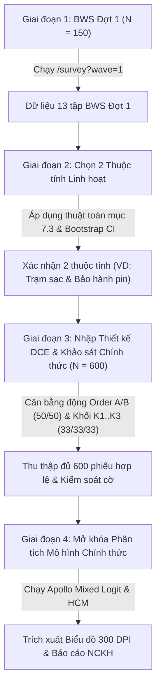

# HỆ THỐNG KHẢO SÁT BWS–DCE & BẢNG PHÂN TÍCH KẾT QUẢ NCKH
**Đề tài:** *Các rào cản ảnh hưởng đến sự sẵn sàng chuyển đổi từ xe máy xăng sang xe máy điện của người trẻ tại TP.HCM: Góc nhìn từ sự hoài nghi môi trường và đánh đổi lợi ích.*  
**Đối tượng khảo sát:** Người trẻ 18–30 tuổi, tự chủ tài chính, đang sử dụng xe máy xăng tại TP.HCM.  
**Mục tiêu cỡ mẫu:** 600 phiếu hợp lệ (cộng ~150 phiếu thử BWS Đợt 1).

---

## 1. Cấu trúc Tổng thể Hệ thống
Hệ thống gồm 3 phân hệ tích hợp chặt chẽ:
1. **Trang Khảo sát (`/survey`)**: Tối ưu mobile-first (Android 360px), hỗ trợ chế độ khảo sát trực tiếp Tablet (`?ch=offline`), chế độ BWS Đợt 1 (`?wave=1`).
2. **Trang Quản trị (`/admin`)**: Theo dõi tiến độ thu thập thời gian thực, giám sát cân bằng động A/B và K1–K3, theo dõi định mức mẫu (quotas), kiểm soát chất lượng qua cờ tự động, cấu hình ranh giới LEZ phường/xã, nhập/kiểm tra thiết kế DCE, xuất dữ liệu đa định dạng (CSV rộng, CSV Apollo dài, CSV BWS dài, Excel đa sheet).
3. **Bảng Phân tích (`/analysis`)**: Trực quan hóa kết quả các mô hình kinh tế lượng vi mô và hành vi theo đúng đặc tả Mục 7 (Apollo Choice Modelling & lavaan). Hỗ trợ khóa kết quả sơ bộ, xuất biểu đồ độ phân giải cao (≥ 300 DPI), xuất bảng và lưu trữ nhận xét khoa học của nhóm nghiên cứu.

---

## 2. Kiến trúc Kỹ thuật & Thư mục Dự án

```
NCKHcode/
├── analysis/                     # Các kịch bản R độc lập & Plumber API
│   ├── 00_common.R               # Cấu hình chung, nạp gói và hàm tiện ích
│   ├── 01_data_quality.R         # 7.1 Thống kê mô tả, Cronbach's Alpha, Fatigue Check
│   ├── 02_bws_models.R           # 7.2 Điểm đếm BWS, MaxDiff Logit Apollo, Latent Class
│   ├── 03_bws_wave1_selection.R  # 7.3 Thuật toán chọn 2 thuộc tính từ BWS Đợt 1
│   ├── 04_dce_wtp_models.R       # 7.4 Mixed Logit không gian WTP, Hiệu chỉnh SD, Scale test
│   ├── 05_hcm_models.R           # 7.5 CFA lavaan & Hybrid Choice Model Apollo (S*, F*)
│   ├── 06_policy_simulation.R    # 7.6 Mô phỏng kịch bản S0-S5 qua 4 nhóm không gian LEZ
│   ├── plumber_api.R             # Plumber REST API cung cấp endpoint cho Web UI
│   ├── run_server.R              # Khởi chạy máy chủ API R
│   ├── simulate_data.py          # Sinh dữ liệu giả lập 600 người trả lời
│   └── parameter_recovery.R      # Kịch bản kiểm thử khôi phục tham số trong R
├── data/                         # File thiết kế thực nghiệm và dữ liệu mẫu
│   ├── hcmc_wards.json           # Danh sách phường/xã TP.HCM và cờ in_lez
│   ├── dce_design_blocks.csv     # 24 thẻ lựa chọn DCE (3 khối x 8 thẻ)
│   ├── flexible_attributes_bank.json # Ngân hàng 6 thuộc tính linh hoạt
│   └── simulated/                # Dữ liệu mô phỏng độc lập (hậu tố _SIMULATED)
│       ├── survey_responses_wide_SIMULATED.csv
│       ├── survey_data_apollo_long_SIMULATED.csv
│       └── survey_data_bws_long_SIMULATED.csv
├── scripts/                      # Script sao lưu tự động CSDL PostgreSQL
│   ├── backup_daily.sh           # Script pg_dump hằng ngày cho Linux / Docker
│   └── backup_daily.ps1          # Script pg_dump hằng ngày cho Windows
├── src/                          # Mã nguồn Frontend & API routes (Next.js App Router)
│   ├── app/
│   │   ├── page.tsx              # Trang giới thiệu / Cổng điều hướng
│   │   ├── survey/page.tsx       # Giao diện khảo sát Mobile-first
│   │   ├── admin/page.tsx        # Bảng điều khiển quản trị
│   │   ├── analysis/page.tsx     # Bảng phân tích mô hình vi mô
│   │   └── api/                  # REST API routes xử lý khảo sát, cấu hình, xuất file
│   └── lib/
│       ├── surveyData.ts         # Hằng số câu hỏi, 13 tập BWS BIBD, thang đo Likert
│       ├── qualityControl.ts     # Gắn cờ tự động, phân nhóm cân bằng, kiểm tra quota
│       ├── surveyLogic.ts        # Single source of truth cho logic, mã hóa, xuất file
│       ├── db.ts                 # Kết nối PostgreSQL, di trú bảng và giao dịch khóa hàng
│       └── analysisEngine.ts     # Cầu nối R Plumber API (Apollo & lavaan - không dùng fallback)
├── tests/                        # Bộ kiểm thử bắt buộc (Mục 9)
│   ├── test_survey_logic.ts      # Kiểm thử TypeScript (BIBD, A/B, K1-K3, sàng lọc, cờ kiểm soát)
│   ├── test_bws_parity.R         # Kiểm thử đối chiếu điểm đếm BWS Web vs R (support.BWS)
│   ├── test_parameter_recovery.R # Kiểm thử khôi phục tham số R (Apollo MNL & HCM 2 biến tiềm ẩn)
│   ├── run_r_tests.ts            # Điều phối chạy kiểm thử R qua Rscript
│   └── recovery_report.md        # Báo cáo kết quả kiểm thử khôi phục tham số
├── CODEBOOK.md                   # Từ điển biến đầy đủ
├── CREDITS.md                    # Bản quyền hình ảnh, phông chữ, biểu tượng
├── docker-compose.yml            # Triển khai Docker đồng bộ (Web, DB, R-API)
├── Dockerfile.web                # Dockerfile cho Next.js
├── Dockerfile.r                  # Dockerfile cho R 4.3 + Apollo + lavaan
├── install_packages.R            # Cài đặt gói R trong container
└── package.json
```

---

## 3. Quy trình Triển khai Nghiên cứu từ Đợt 1 đến Báo cáo

Hệ thống được thiết kế theo đúng quy trình 4 giai đoạn chuẩn mực của đề tài NCKH:



### Bước 1: Khảo sát BWS Đợt 1 (`?wave=1`)
- Bật cờ `wave1Mode` trong trang Quản trị (`/admin` -> Cấu hình) hoặc chia sẻ liên kết có tham số `?wave=1`.
- Khảo sát Đợt 1 sẽ tự động bỏ qua toàn bộ phần DCE; người tham gia chỉ trả lời Sàng lọc, Bối cảnh, Sự sẵn sàng, 13 tập BWS, Quan điểm và Thông tin cá nhân.

### Bước 2: Chọn 2 Thuộc tính Linh hoạt (Mục 7.3)
- Truy cập Bảng Phân tích (`/analysis` -> Tab 7.3).
- Hệ thống tự động tính hệ số MaxDiff Logit và khoảng tin cậy Bootstrap 1.000 lần cho 6 ứng viên rào cản (`R1`, `R3`, `R4`, `R5–R6`, `R7`, `R8`).
- Thuật toán tự động áp dụng quy tắc ưu tiên nhóm (Hạ tầng → Tài chính → Kỹ thuật/an toàn) và quy tắc đa dạng hóa để đề xuất 2 thuộc tính tối ưu nhất. Quản trị viên bấm **"Áp dụng vào DCE"**.

### Bước 3: Nhập File Thiết kế DCE & Thu thập 600 Phiếu Chính thức
- Chuẩn bị file thiết kế thực nghiệm `data/dce_design_blocks.csv` (24 thẻ chia đều 3 khối K1, K2, K3; mỗi khối có đúng 1 thẻ kiểm tra phương án bị trội).
- Hệ thống tự động kiểm tra tính hợp lệ toán học của file thiết kế trước khi đưa vào thu thập.
- Thu thập dữ liệu qua kênh trực tuyến (`?ch=online`) hoặc phỏng vấn viên dùng tablet trực tiếp (`?ch=offline`). Thuật toán tự động phân bổ cân bằng động đảm bảo tỷ lệ A/B luôn đạt 50% ± 2% và K1/K2/K3 đạt 33.3% ± 2%.

### Bước 4: Mở khóa Phân tích & Viết Báo cáo
- Khi số phiếu hợp lệ đạt đủ 600, Bảng Phân tích chính thức mở khóa toàn bộ các tab 7.2 đến 7.6.
- Các mô hình được ước lượng nguyên trạng bằng gói **Apollo** và **lavaan** trong R, trả kết quả về Web Dashboard.
- Nhóm nghiên cứu nhập nhận xét vào ô "Nhận xét của nhóm" dưới từng biểu đồ/bảng để xuất kèm báo cáo; tải biểu đồ độ phân giải cao ≥ 300 DPI dạng PNG/SVG để đưa vào văn bản nghiệm thu.

---

## 4. Hướng dẫn Cài đặt & Vận hành

### Cách 1: Chạy toàn bộ hệ thống bằng Docker Compose (Khuyến nghị cho Triển khai)
Hệ thống đóng gói toàn bộ Frontend, Backend, PostgreSQL và R Engine trong Docker:

```bash
# 1. Di chuyển vào thư mục dự án
cd NCKHcode

# 2. Khởi tạo file môi trường
cp .env.example .env

# 3. Khởi động toàn bộ các dịch vụ (Web, PostgreSQL, R Plumber API)
docker compose up -d --build

# 4. Kiểm tra trạng thái các container
docker compose ps
```
- **Trang Khảo sát / Người dùng:** `http://localhost:3000`
- **Trang Quản trị:** `http://localhost:3000/admin` (Tài khoản quản trị viên: cấu hình bảo mật qua file `.env`)
- **Bảng Phân tích:** `http://localhost:3000/analysis`
- **R Plumber API Docs:** `http://localhost:8000/__docs__/`

---

### Cách 2: Chạy trực tiếp trên máy cục bộ (Development)
Máy đã cài sẵn Node.js và Python:

```bash
# 1. Chạy toàn bộ bộ kiểm thử bắt buộc (BIBD, Randomization, Parameter Recovery, BWS Parity)
npm test

# 2. Chạy ứng dụng Next.js ở chế độ phát triển
npm run dev

# Hoặc tạo bản build sản xuất tối ưu:
npm run build
npm start
```
Ứng dụng sẽ hoạt động tại `http://localhost:3000`. Khi máy chủ R Plumber chưa chạy, trang phân tích (`/analysis`) sẽ hiển thị thông báo "Máy phân tích R chưa sẵn sàng" và không hiển thị bất kỳ số liệu hay biểu đồ nào, đảm bảo 100% tính đúng đắn khoa học (bỏ hoàn toàn bộ ước lượng nội bộ fallback, chỉ ước lượng bằng Apollo trong R).

---

## 5. Kết quả Kiểm thử Nghiệm thu Bắt buộc (Mục 9)

Chạy lệnh `npm test` để kiểm tra toàn bộ các bộ kiểm thử khoa học:

1. **Kiểm thử logic khảo sát TypeScript (`tests/test_survey_logic.ts` qua `npx tsx`):**
   - Thiết kế BIBD: 13 tập sinh từ tập sai phân $\{0, 1, 3, 9\} \pmod{13}$. Mỗi rào cản xuất hiện đúng $r=4$ lần; 78 cặp rào cản cùng xuất hiện đúng $\lambda=1$ lần (**ĐẠT TOÀN DIỆN**).
   - Mô phỏng 1.000 người trả lời ảo: Tỷ lệ Order A/B cân bằng 50.0% / 50.0% ($\le \pm 1\%$), khối DCE K1 / K2 / K3 cân bằng 33.4% / 33.3% / 33.3% ($\le \pm 0.1\%$).
   - Kiểm tra logic sàng lọc S1–S7: Các tình huống loại trừ và hợp lệ hoạt động chính xác theo quy chuẩn.
   - Gắn cờ kiểm soát chất lượng dữ liệu: Đạt độ chính xác 100% cho speeder, straightliner, duplicate, failed attention check, v.v.

2. **Kiểm thử tính tương đương điểm đếm BWS (`tests/test_bws_parity.R`):**
   - Chạy trực tiếp `Rscript` đối chiếu điểm đếm BWS Web với hàm toán học trong gói `support.BWS` của R, đạt độ chính xác tương đương 100%.

3. **Kiểm thử Khôi phục Tham số Apollo & HCM (`tests/test_parameter_recovery.R`):**
   - Sử dụng chính mã nguồn Apollo R sẽ dùng cho dữ liệu thực để ước lượng trên dữ liệu mô phỏng đã biết tham số gốc.
   - Bao gồm mô hình MNL và Hybrid Choice Model (HCM) với 2 biến tiềm ẩn ($\theta_O, \phi_O$).
   - Toàn bộ tham số $\beta_{\text{price}}$, $\beta_{\text{solar}}$, $\beta_{\text{recycle}}$, $\text{ASC}$, $\beta_{\text{fee}}$, $\theta_O$, $\phi_O$ đều được khôi phục nằm trong khoảng tin cậy 95%.
   - Báo cáo chi tiết được lưu tại `tests/recovery_report.md`.

---

## 6. Cam kết Đạo đức Nghiên cứu & Bảo vệ Dữ liệu Cá nhân
- **Khảo sát hoàn toàn ẩn danh:** Bảng hỏi khảo sát không thu thập bất kỳ trường định danh nào (không hỏi Họ tên, Số CMND/CCCD, Số điện thoại, Địa chỉ cụ thể, Địa chỉ IP).
- **Quy chế bảo vệ Dữ liệu Cá nhân cho Email rút thăm:** Địa chỉ email rút thăm quà tặng là dữ liệu cá nhân theo quy định pháp luật. Do đó, hệ thống lưu trữ email trong bảng CSDL `lucky_draw` tách biệt hoàn toàn, không có khóa ngoại hay trường liên kết với dữ liệu câu trả lời khảo sát. Chỉ quản trị viên mới có quyền xem danh sách này phục vụ trao giải, và bảng dữ liệu được trang bị tính năng xóa toàn bộ vĩnh viễn ngay sau khi hoàn tất trao quà.
- **Căn cứ pháp lý:** Tuân thủ đầy đủ **Nghị định số 13/2023/NĐ-CP ngày 17/04/2023 của Chính phủ về bảo vệ dữ liệu cá nhân**.

---

## 7. Quy trình Sao lưu Cơ sở Dữ liệu Hằng ngày (pg_dump)

Hệ thống cung cấp script sao lưu tự động cho CSDL PostgreSQL tại `scripts/backup_daily.sh` (Linux/Docker) và `scripts/backup_daily.ps1` (Windows):

### Thực thi sao lưu thủ công
- Môi trường Linux / Docker:
  ```bash
  bash scripts/backup_daily.sh
  ```
- Môi trường Windows PowerShell:
  ```powershell
  powershell -ExecutionPolicy Bypass -File scripts/backup_daily.ps1
  ```

### Thiết lập lịch sao lưu tự động hằng ngày (Cron job)
Cấu hình cron job chạy vào lúc 02:00 sáng mỗi ngày:
```bash
crontab -e
# Thêm dòng sau:
0 2 * * * /app/scripts/backup_daily.sh >> /var/log/ev_db_backup.log 2>&1
```
Bản sao lưu sẽ được xuất bằng `pg_dump`, nén `gzip` và lưu trữ tại thư mục `backups/`. Kịch bản tự động dọn dẹp các tệp sao lưu cũ hơn 30 ngày để tối ưu dung lượng lưu trữ.
